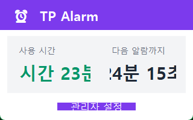
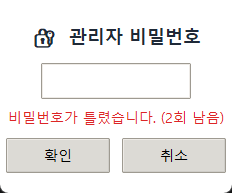
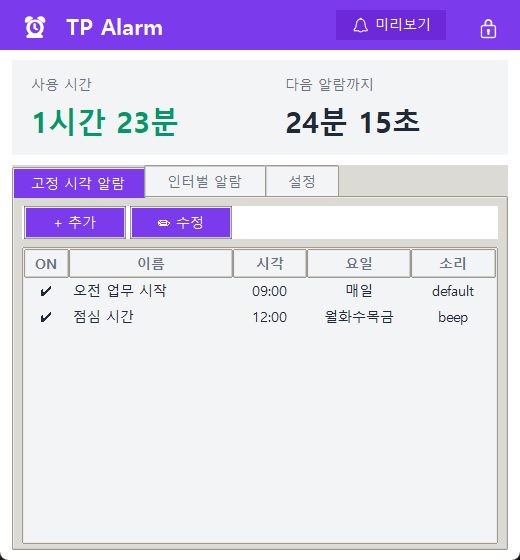

# Sprint 07 — 결과 보고서

**스프린트:** 07 / 관리자 잠금 & 트레이 개선  
**완료일:** 2026-05-12  
**상태:** ✅ 완료

---

## 완료된 작업

| 항목 | 결과 |
|------|------|
| AUTH-01: PIN 저장 (`AppSettings.admin_pin = "0104"`) | ✓ |
| AUTH-01: `ConfigManager.check_pin()` | ✓ |
| AUTH-02: `PinDialog` (3회 실패 자동 닫힘, Enter 지원) | ✓ |
| UI-01: 상태 뷰 — 사용 시간 + [관리자 설정] 버튼 (320×200) | ✓ |
| UI-02: 관리 뷰 — 탭 + [🔒 잠금] 버튼 (520×560) | ✓ |
| `AlarmManager.get_active_alarm_count()` | ✓ |
| TRAY-01: 동적 시계 아이콘 (현재 시각 시침/분침) | ✓ |
| TRAY-02: 툴팁 갱신 5초 | ✓ |
| TRAY-03: 툴팁 날짜 + 활성 알람 수 | ✓ |

---

## 수동 검증 결과

→ QC.md 참고

---

## 산출물

| 파일 | 변경 내용 |
|------|-----------|
| `src/config_manager.py` | `AppSettings.admin_pin`, `check_pin()` |
| `src/alarm_manager.py` | `get_active_alarm_count()` |
| `src/main_window.py` | 전면 재구성: 2-모드, `PinDialog`, `_enter_status_mode`, `_enter_mgmt_mode` |
| `src/tray_app.py` | 동적 아이콘, 5초 갱신, 툴팁 보강 |

---

## 스크린샷

| 화면 | 파일 |
|------|------|
| 상태 뷰 (트레이에서 열기) | `screenshots/01_status_view.png` |
| PIN 입력 다이얼로그 | `screenshots/02_pin_dialog.png` |
| 관리 뷰 (PIN 인증 후) | `screenshots/03_mgmt_view.png` |

---

## 다음 스프린트 이관 사항

| 항목 | 내용 |
|------|------|
| PIN 변경 기능 | 설정 탭에서 PIN을 변경할 수 있는 UI |
| 로그인 세션 유지 | 창을 닫아도 일정 시간 인증 유지 옵션 |
