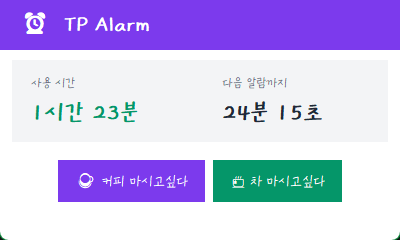
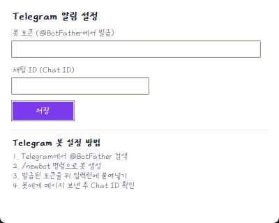

# Sprint 08 — 결과 보고서

**스프린트:** 08 / 폰트·UI 정제 & 음료 요청 알림  
**완료일:** 2026-05-12  
**상태:** ✅ 완료

---

## 완료된 작업

| 항목 | 결과 |
|------|------|
| FONT-01: `font_loader.py` — TTF 등록, `"Kyobo Handwriting 2025"` 반환 | ✓ |
| FONT-02: main_window, notification 전체 폰트 교체 | ✓ |
| UI-01: 상태 뷰 320×200 → 400×240 (텍스트 잘림 해소) | ✓ |
| UI-02: 관리자 버튼 투명화 (헤더 우측 상단 숨김 영역) | ✓ |
| UI-03: ☕ / 🍵 버튼 상태 뷰에 추가 | ✓ |
| NOTIF-01: `notifier.py` — Telegram 비동기 발송 | ✓ |
| NOTIF-02: 설정 탭 Telegram 토큰/채팅ID 입력 UI | ✓ |
| config: `AppSettings.telegram_token`, `telegram_chat_id` | ✓ |

---

## 스크린샷

| 화면 | 파일 |
|------|------|
| 상태 뷰 (커피/차 버튼, 교보 폰트) | `screenshots/01_status_view.png` |
| 설정 탭 Telegram 설정 | `screenshots/02_telegram_settings.png` |

---

## 다음 스프린트 이관 사항

| 항목 | 내용 |
|------|------|
| PIN 변경 UI | 설정 탭에서 현재 PIN → 새 PIN 변경 |
| 음료 요청 이력 | 언제 누가 요청했는지 로그 저장 |
